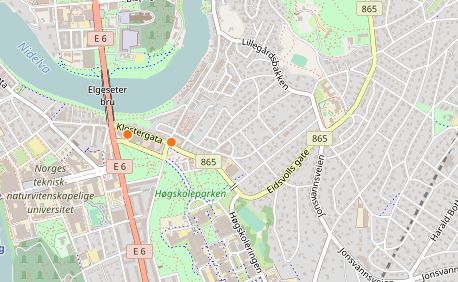

# Norkart-webkurs


## Innhold:

- [Oppgave](#oppgave)
- [Kjøre koden](#kjøre-koden)
- [Bakgrunnskart](#bakgrunnskart)
- [Tutorial](#tutorial)

## Oppgave
Lag en nettside som på best mulig måte viser dine topp tre utesteder i Trondheim. Ta utganspunkt i koden som ligger i mappen [task-boilerplate](./task-boilerplate).

## Kjøre koden
Last ned koden ved å trykke "Clone or Download". Deretter last ned zip, eller clone hvis du har git installert. Når koden er lastet ned kan du gå inn i mappen som heter `task-boilerplate` og åpne `index.html` i nettleseren, og du er i gang!

## Bakgrunnskart

Bakgrunnskart definerer stilen på kartet, og kan enkelt byttes i koden i `public/js/index.js`.

```javascript

    var basemapUrl='http://{s}.tile.osm.org/{z}/{x}/{y}.png';
    L.tileLayer(basemapUrl).addTo(map);

```
Her er noen eksempler på bakgrunnskart dere kan bruke. Det eneste dere trenger å gjøre er å endre `basemapUrl`.


Url: `https://api.mapbox.com/styles/v1/mapbox/light-v9/tiles/256/{z}/{x}/{y}?access_token=pk.eyJ1IjoibWF0aGlsZG8iLCJhIjoiY2lrdHZvMHdsMDAxMHdvbTR0MWZkY3FtaCJ9.u4bFYLBtEGNv4Qaa8Uaqzw`


Url: `https://api.mapbox.com/styles/v1/mapbox/satellite-v9/tiles/256/{z}/{x}/{y}?access_token=pk.eyJ1IjoibWF0aGlsZG8iLCJhIjoiY2lrdHZvMHdsMDAxMHdvbTR0MWZkY3FtaCJ9.u4bFYLBtEGNv4Qaa8Uaqzw`


Url: `https://api.mapbox.com/styles/v1/mapbox/streets-v10/tiles/256/{z}/{x}/{y}?access_token=pk.eyJ1IjoibWF0aGlsZG8iLCJhIjoiY2lrdHZvMHdsMDAxMHdvbTR0MWZkY3FtaCJ9.u4bFYLBtEGNv4Qaa8Uaqzw`




Url: `http://{s}.tile.osm.org/{z}/{x}/{y}.png`


## Tutorial med eksempler på hva man kan gjøre <a name="tutorial"> </a>
http://leafletjs.com/examples/geojson/


